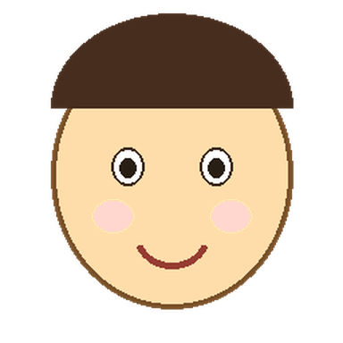

# slack-stamp-maker

Turn a single portrait into a whole pack of animated Slack emoji — and into a
giant 3×3 "big emoji" mosaic — with one command each.

Give it a face, get back 14 looping GIFs (pulse, shake, spin, rainbow, a
party-parrot-style head bob, plus "hard" = bigger & faster variants), all sized
**128×128** and kept **under Slack's 128 KB** custom-emoji limit.

| parrot | pulse | zoom | rainbow_tint | shake_hard | spin |
|:--:|:--:|:--:|:--:|:--:|:--:|
|  |  |  |  |  |  |

*(Demo uses a drawn placeholder avatar, not a real person.)*

## Install

```bash
pip install pillow
```

## Animated emoji

```bash
python make_stamps.py face.png alice
# writes 14 GIFs to ./alice_stamps/
```

Options:

- `--out DIR` — choose the output directory (default `./<name>_stamps`).

A **cut-out PNG with a transparent background** looks cleanest. A normal photo
works too, but the whole rectangle (background included) will animate.

### What you get

| name | motion |
|---|---|
| `pulse` | scales in and out (heartbeat) |
| `shake` | sways left–right |
| `vibrate` | jitters in place |
| `wobble` | tilts back and forth |
| `spin` | one full rotation |
| `rainbow_bg` | background cycles through the rainbow (and back to plain once per loop) |
| `rainbow_tint` | the face itself tints rainbow, returning to the original once per loop |
| `party` | pulse + rainbow background |
| `zoom` | pushes in hard (up to 2.6×) |
| `parrot` | party-parrot-style head bob over a cycling rainbow |
| `*_hard` | `shake`, `vibrate`, `pulse`, `parrot` — bigger & faster |

## 3×3 giant "big emoji"

```bash
python make_big3x3.py face.png alice
# writes 9 tiles + a layout note to ./alice_stamps/
```



This slices the (center-cropped) portrait into nine 128×128 tiles named
`alice_big_r1c1` … `alice_big_r3c3`. Register all nine as custom emoji, then
paste the three lines from the generated `*_big3x3_layout.txt` into a message:

```
:alice_big_r1c1::alice_big_r1c2::alice_big_r1c3:
:alice_big_r2c1::alice_big_r2c2::alice_big_r2c3:
:alice_big_r3c1::alice_big_r3c2::alice_big_r3c3:
```

Slack stacks them into one big 384×384 picture.

## Uploading to Slack

Workspace settings → **Customize** → **Emoji** → **Add Custom Emoji**, then
upload each GIF/PNG and give it a name. (Workspace admins can disable custom
emoji, in which case you'll need an admin to add them.)

## Notes

- Tune motion by editing the constants in `make_stamps.py` (amplitudes, frame
  counts, `duration_ms`). Lower frame counts / fewer colors → smaller files.
- Photo-heavy frames are color-reduced automatically to stay under 128 KB.
- Be mindful of consent before making emoji of real people, especially in
  public or shared workspaces.

## License

MIT — see [LICENSE](LICENSE).
